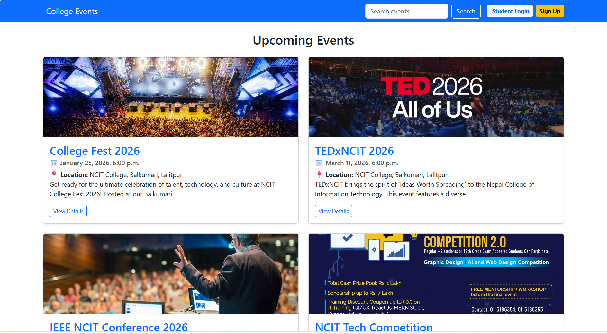
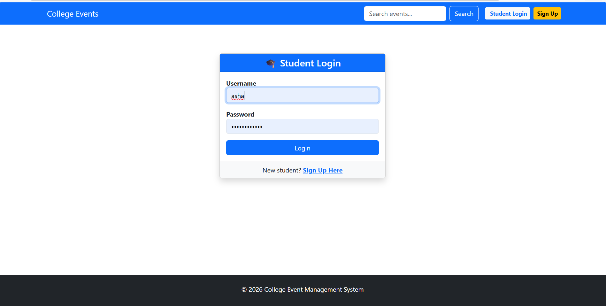

# 🎓 College-Event-Management-System

A robust web application built using the **Django framework**, designed to streamline the organization and registration process for campus events.

# 🚀 Key Features
* **Real-time Capacity Tracking:** Automatically calculates available seats to prevent over-booking.
* **Secure Authentication:** Separate portals for Students and Administrators using Django's built-in security.
* **Event Discovery:** A searchable dashboard for students to find upcoming fests and workshops.
* **Admin Dashboard:** A centralized interface for staff to manage event details and monitor participation.

# 🛠️ Tech Stack
* **Backend:** Python, Django
* **Frontend:** HTML5, CSS3, Bootstrap
* **Database:** SQLite (Development)

# 📸 Screenshots

  
  

# 🧪 Testing
To ensure the system is running correctly, follow these steps:
1. **Server Check:** Run `python manage.py runserver` to ensure the server starts.
2. **Database:** Run `python manage.py migrate` to verify all tables are created.
3. **Functional Test:** Create a test event in the `/admin` panel and register as a student to check capacity updates.

# 🛠️ Environment Setup Procedure
Follow these steps to get the project running on your local machine:

## 1. Prerequisites
Ensure you have Python 3.8+ installed.

Ensure Git is installed and configured in your path.

## 2. Clone the Repository
Open your terminal and run:

git clone https://github.com/your-username/your-repo-name.git

cd your-repo-name
## 3. Create a Virtual Environment
It is highly recommended to use a virtual environment to keep dependencies isolated:

Bash
### Windows
python -m venv env

.\env\Scripts\activate

### macOS/Linux
python3 -m venv env
source env/bin/activate

## 4. Install Dependencies
Install the required packages (make sure you are in the same folder as manage.py):

Bash
pip install -r requirements.txt
## 5. Apply Migrations
Set up the database schema:

Bash
python manage.py migrate
## 6. Run the Application
Start the development server:

Bash
python manage.py runserver
Visit http://127.0.0.1:8000/ in your browser to see the app live!

# 🏁 Conclusion
By following this procedure, visitors can establish a clean development environment for the College Event Management System. This setup ensures that the Django application runs smoothly and securely on any local machine.
This system solves the "mess" of unmanaged event registration by providing a digital gateway for students. Future updates will include automated email notifications and certificate generation.

